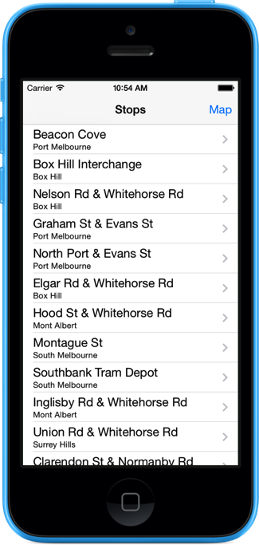
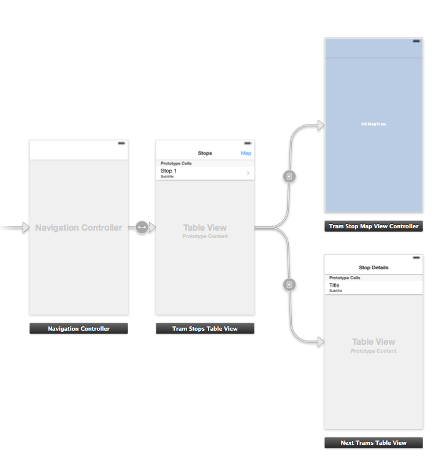

# TramTracker

A small demo application for [WWCM August 2014](http://www.meetup.com/Women-Who-Code-Melbourne/events/186812772) taking advantage of the [TramTracker API](http://ws3.tramtracker.com.au/TramTracker/RestService/help)

This application is hardcoded for route 109.

Thanks to [Sync/@NSFounder](https://github.com/sync) for help navigating the TramTracker API.

## Designed for Demo

The project will be demonstrated live on the night. If you're following along start by downloading the code at [various checkpoints](https://github.com/jessedc/TramTracker/releases).

## Screenshot

## Storyboard Layout

